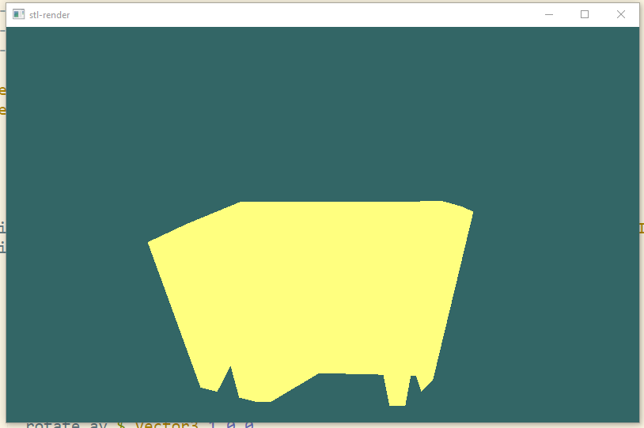

#render stl files with haskell and opengl

An [stl](https://en.wikipedia.org/wiki/STL_(file_format)) file is one way to save a 3d mesh. It encodes the data as a list of triangles. Here is an example of a file that I exported from [meshlab](http://www.meshlab.net/)

    solid STL generated by MeshLab
        facet normal  7.071067e-01 -0.000000e+00  7.071069e-01
          outer loop
            vertex   6.278541e+00 -2.200000e+01 -9.250000e+00
            vertex   8.278542e+00 -2.200000e+01 -1.125000e+01
            vertex   6.278541e+00 -2.050000e+01 -9.250000e+00
          endloop
        endfacet
        facet normal  7.071067e-01  0.000000e+00  7.071069e-01
        outer loop
          vertex   6.278541e+00 -2.050000e+01 -9.250000e+00
          vertex   8.278542e+00 -2.200000e+01 -1.125000e+01
          vertex   8.278542e+00 -2.050000e+01 -1.125000e+01
        endloop
        endfacet
    endsolid vcg

The facet normal can be ommited like `facet normal 0 0 0`.

>[In most software this may be set to (0,0,0), and the software will automatically calculate a normal based on the order of the triangle vertices using the "right-hand rule".](https://en.wikipedia.org/wiki/STL_(file_format)#The_facet_normal)

##I want to render stl files with opengl and haskell.

```haskell
reshape :: IORef (Maybe Size) -> Size -> IO ()
reshape currentWindowSize s = do
    currentWindowSize $= Just s
    -- putStrLn $ "window resized to " ++ show s
    viewport $= (Position 0 0, s)

quit :: IO()
quit = do
    exitWith ExitSuccess

keyboard :: Key -> KeyState -> Modifiers -> Position -> IO()
keyboard (Char '\ESC') Up _ _ =
    quit
keyboard _ _ _ _ = return ()

passiveMouse :: IORef Float -> IORef Float -> Position -> IO ()
passiveMouse anglx angly (Position x y) = do
    anglx $= fromIntegral x
    angly $= fromIntegral y

main :: IO ()
main = do
    getArgsAndInitialize
    initialDisplayMode $= [WithDepthBuffer, DoubleBuffered]
    createWindow "stl-render"
    windowSize $= Size 800 500
    anglx <- newIORef 0.0
    angly <- newIORef 0.0
    currentWindowSize <- newIORef (Nothing :: Maybe Size)
    depthFunc $= Just Less
    points <- readFile "standee.stl" >>= (return . parsePoints)
    displayCallback $= displaySTL points anglx angly
    reshapeCallback $= Just (reshape currentWindowSize)
    keyboardMouseCallback $= Just keyboard
    passiveMotionCallback $= Just (passiveMouse anglx angly)
    matrixMode $= Projection
    loadIdentity
    let near   = 1
        far    = 40
        right  = 1
        top    = 1
    frustum (-right) right (-top) top near far
    matrixMode $= Modelview 0
    mainLoop

displaySTL :: [(Float, Float, Float)] -> IORef Float -> IORef Float -> IO ()
displaySTL points anglx angly = do
    loadIdentity
    clearColor $= Color4 0.2 0.4 0.4 1
    clear [ColorBuffer, DepthBuffer]
    currentColor $= Color4 1.0 1.0 0.5 1
    ax <- get anglx
    ay <- get angly
    scale 0.05 0.05 (0.05::GLfloat)
    rotate ax $ Vector3 0 1 0
    rotate ay $ Vector3 1 0 0
    translate (Vector3 0 0 (-10::GLfloat))
    renderWithShading points
    swapBuffers
    flush
    postRedisplay Nothing

renderWithShading :: [(Float, Float, Float)] -> IO ()
renderWithShading points =
    renderPrimitive Triangles $ mapM_ vertex3f points

```

I'm starting with this. It's just two colors but it's enough informaiton to see that it is reading points from the file and rendering them correctly.


3ebdf6d2fcfc5714138f1729aec0125641f45c88

##shading

The next step is to add shading.

I'm going to compute the normal of the triangle and then take the angle between that vector and a vector from the triangle to the camera.

